## CI/CD Solutions with GitHub Actions

### Setting Up the Environment

#### Salesforce Setup

1. **Install Salesforce CLI:** [Download Salesforce CLI](https://developer.salesforce.com/tools/salesforcecli)
2. **Salesforce Extension Pack:** Install Salesforce Extension Pack for VS Code
3. **Create SF orgs:** [Sign Up](https://developer.salesforce.com/signup)
4. **Connect VS Code to the orgs**

#### GitHub Setup

1. **Register on GitHub:** [Sign Up](https://github.com/join)
2. **Create a repository:** [New Repository](https://github.com/new)
3. **Download GitHub Desktop and connect your repository:** [Download Github Desktop](https://github.com/apps/desktop)
4. **Generate sfdxAuthUrl:**
   - Login to your orgs from VS code
   - Generate and save your sfdxAuthUrl by running the following command (replace your-org-name with your org name):
   ```sf org display --verbose --json -o your-org-name ```
   - Save the content of the marked line (string after "force://PlatformCLI::)
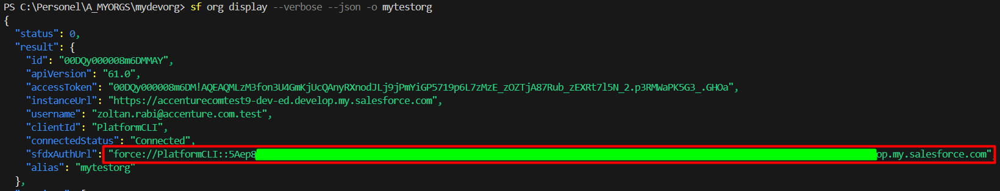
---

## GitHub Configuration

### Repository Secrets and Permissions

1. **Create repository secrets:**
   - Go to repository Settings -> Secrets and Variables -> Actions -> New Repository Secret
   - Create the secrets with the following names and set the values to the previously generated sfdxAuthUrls:
     - SFDX_AUTH_URL_INT
     - SFDX_AUTH_URL_UAT
     - SFDX_AUTH_URL_PROD

2. **Add repository variables:**
   - Change to variables tab and add New repository variables:
     - INT_BRANCH = int
     - UAT_BRANCH = uat
     - MAIN_BRANCH = main
     - INT_ORG = INT

3. **Set workflow permissions:**
   - Go to Settings -> Actions -> General.
   - Set Read and Write permissions.

### GitHub Branch Rules

1. **Add Rules to branches:**
   - Repeat the steps bellow for each of your branches
   - Go to repository Settings -> Rules -> Rulesets.
   - Add new Ruleset with configurations:
     - Target: Your branch name (int, uat, main)
     - Restrict deletions
     - Require pull request before merging
     - Required Approvals (1)
     - Dismiss stale pull request approvals when new commits are pushed
     - Require approval of the most recent reviewable push
     - Require status checks to pass (e.g., validate)
     - Block force pushes

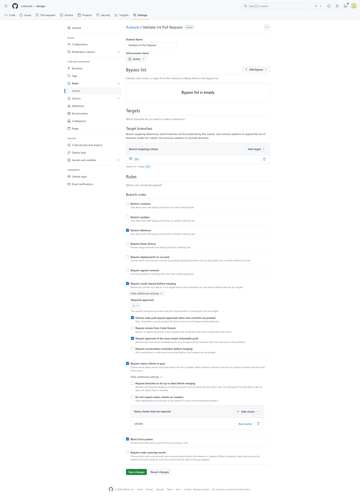
2. **It is possible to restrict who can push to branches. To set it up follow the documentation:**
     - [Protection rules](https://docs.github.com/en/repositories/configuring-branches-and-merges-in-your-repository/managing-protected-branches/managing-a-branch-protection-rule)

---

## Workflows, Actions, and Scripts

### Pull Request flow automation

#### Pull Request process
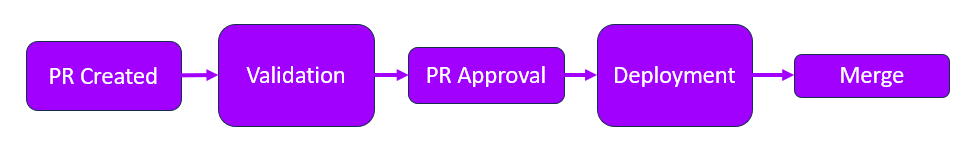
1. **PR Creation**
   - Branch rules require an approval and the Validation workflow to run. Validation workflow start automatically after the PR is created.
2. **Validation**
   - Validate the changes against target org. Types:
     - Delta: *TEST_LEVEL* is: RunSpecifiedTests. DELTA validation means that test only those will run which are connected to the changes in the PR:
       - Test classes: changed test classes
       - Normal classes/triggerclasses: Test classes which are related to a changed class (for example: if AccountTrigger.cls is changed the code will try to find test classes which has Test at the end of the class name and Account anywhere in the class name)
       - Validation rule: Object related test classes related to a changed validation rule (for example: if you change Validation rule related to the Account Object the code will gather the test classes which has Test at the end of the class name and Account anywhere in the class name)
       - Record-Triggered flows: Test classes realted to Record-Triggered flows
       - Fields: The test classes related to the Object for which field is changed
     - Full: *TEST_LEVEL* is: RunLocalTests. Runs all test
3. **PR Approval**
   - PR needs to be approved at least by one approver after the Validation executes successfully. It triggers the automatic Deployment. 
4. **Deployment**
   - Deploy the changes to the target org. None of the three option run(TEST_LEVEL=NoTestRun) test because tests were already executed during the validation. Types:
     - FULL: deploy the branch to the org
     - DELTA: deploy only the changes files to the org
     - QUICK: deploy the last validated deployment to the org. It can be used for example in prod. It queries the Id of the last validation job from the org and use it for Quick deployment
5. **Merge**
   - Code is merged to the target branch after successful deployment
#### Validation and deployment workflow key components and configuration
1. **Validation.yml workflow**
   - It triggers when a PR is created
   - It contains the configuration for the validation:
     - branches: the used branch names are listed (int, uat, main)
     - run-name: it will generate the name for the workflow which is visible in the Action tab in the GitHub repository. It check against which branch we are doing the validation. It generates the corresponding Action name with the org names
     - Under jobs: -> validate: -> name: _Set SFDX Auth URL and Test Level_. It defines the *SFDX_AUTH_URL* based on the target org and the *TEST_LEVEL* for the validation. *DEPLOY_TYPE* variable controls if the validation is DELTA validation or FULL validation. Two combination is possible:
       - *DEPLOY_TYPE* = DELTA and **TEST_LEVEL* = RunSpecifiedTests
       - *DEPLOY_TYPE* = FULL and *TEST_LEVEL* = RunLocalTests
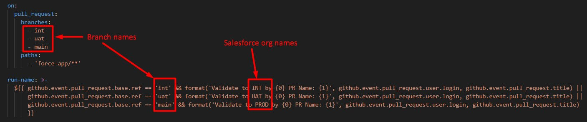
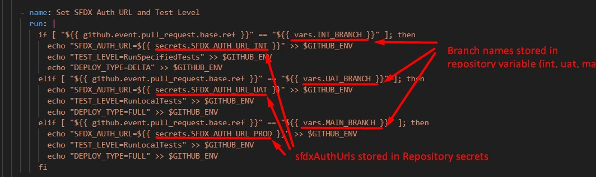
2. **Deploy.yml workflow**
   - It triggers when a PR is approved
   - It contains similar configurations like the validation workflow:
     - run-name: it will generate the name for the workflow which is visible in the Action tab in the GitHub repository. It check against which branch we are doing the validation. It generates the corresponding Action name with the org names
     - Under jobs: -> validate: -> name: Set Environment Variables. It defines the sfdxAuthUrl based on the target org and the DEPLOY_TYPE for the deployment. DEPLOY_TYPE variable controls if the deployment is DELTA, FULL or QUICK deployment.
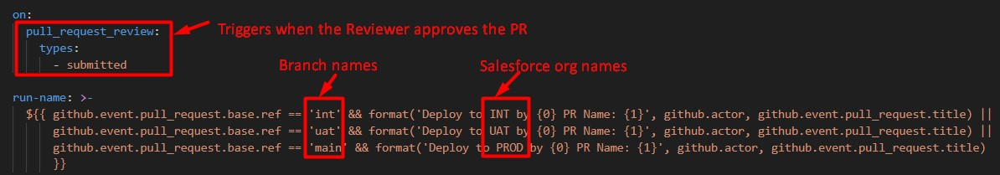
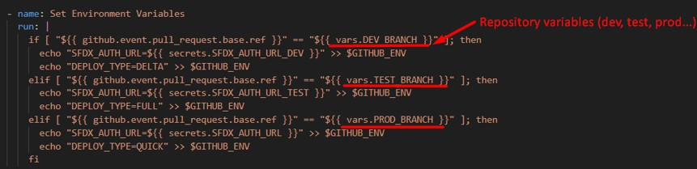
### Add new branch for PR workflow
   - Create a new Repository variable with your branch name (SFDX_AUTH_URL_YOURORG)
1. **Add new branch to validation.yml** (legyen egyben a 4-el es alatta szeparalni)
   - Add your branch name to the branches section so it will triggered when a PR is created to that branch
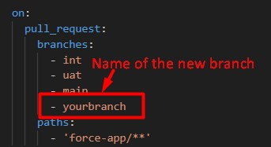
   - Copy-paste a new line in the run-name section and configure the desired action name
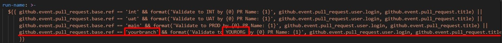
   - Copy-paste an elseif statement in the Set SFDX Auth URL and Test Level job. Replace the branch repository variables with yours and setup the desired TEST_LEVEL and DEPLOY_TYPE. Two combination is possible:
     - *DEPLOY_TYPE* = DELTA and *TEST_LEVEL* = RunSpecifiedTests
     - *DEPLOY_TYPE* = FULL and *TEST_LEVEL* = RunLocalTests
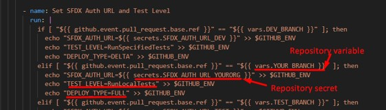
2. **Add new branch to deploy.yml**
   - Copy-paste a new line in the run-name section and configure the desired action name
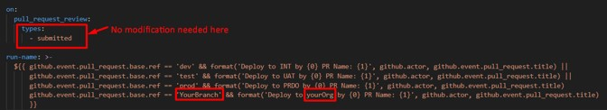
   - Copy-paste an elseif statement in the Set SFDX Auth URL and Test Level job. Replace the branch repository variables with yours and setup the desired DEPLOY_TYPE. Possible deployment types
     - FULL: deploy the branch to the org
     - DELTA: deploy only the changes files to the org
     - QUICK: deploy the last validated deployment to the org. It can be used for example in prod. It queries the Id of the last validation job from the org and use it for Quick deployment
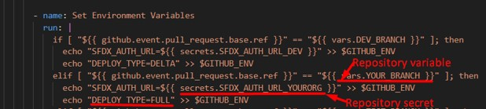
### Scheduled Deploy to Org
1. **What does it do?**
   - By default it deploy the _int branch_ to the _INT org_
   - It runs every midnight
   - Timing defined by cron expression: '0 0 * * *' EJJEL 2 LEGYEN
   - Cron cheatsheet:
# Cron Fields Table
| `*` | `*` | `*` | `*` | `*` |
|-----|-----|-----|-----|-----|
| Minute (0-59) | Hour (0-23) | Day of the Month (1-31) | Month (1-12) | Day of the Week (0-6) |

| **Cron Expression** | **Schedule**                          |
|---------------------|----------------------------------------|
| `* * * * *`         | Every minute                          |
| `0 * * * *`         | Every hour                            |
| `0 0 * * *`         | Every day at 12:00 AM                 |
| `0 0 * * FRI`       | At 12:00 AM, only on Friday           |
| `0 0 1 * *`         | At 12:00 AM, on day 1 of the month    |
2. **Configuration**
   - Based on the tables above, you can modify the cron expression and thus adjust the timing of this flow
   - After ref: you can change the reference to a different branch name. This branch will will be used for deplyoment
   - You can change the variable in the name so it will name your job correctly while running. Create a Repository variable or hard code it
   - Change the target or by assigning another value to the SFDX_AUTH_URL variable
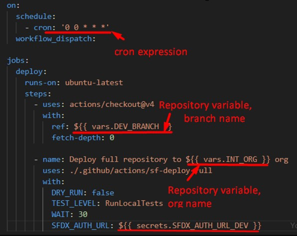
### Import Data from GitHub to Org
1. **Create your data**
   - Place your query into the following command and run it to generate data from your org. 
   ```sf data export tree --target-org mysforg –query “<Your Query>” --prefix export-demo --output-dir .github/data –plan```
   - Make sure that your data is in the .github/data folder
   - Setup the desired branch and setup the path for the DATA_FOLDER variable
   - To change the target org, you can change the SFDX_AUTH_URL. By default it imports data from ref branch(_int_) to _INT org_.
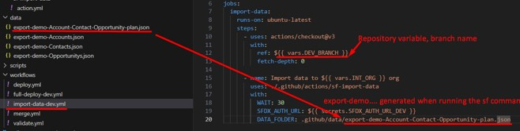
2. **Import data**
   - In your repository go to the Actions tab
   - On the left side select Import data to INT
   - On the right side select run workflow
   - It doesn’t matter which org you select in the dropdown menu. It will import data to the org which is configured in the workflow
### PR template
   - 
